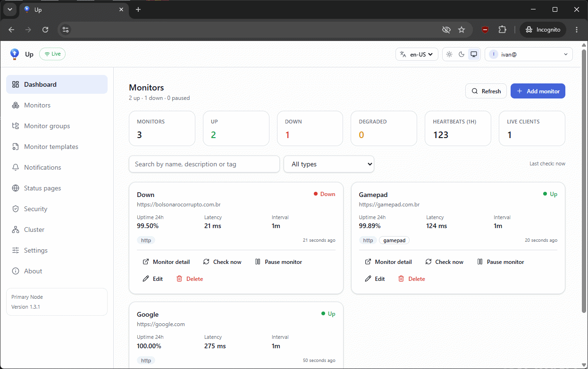
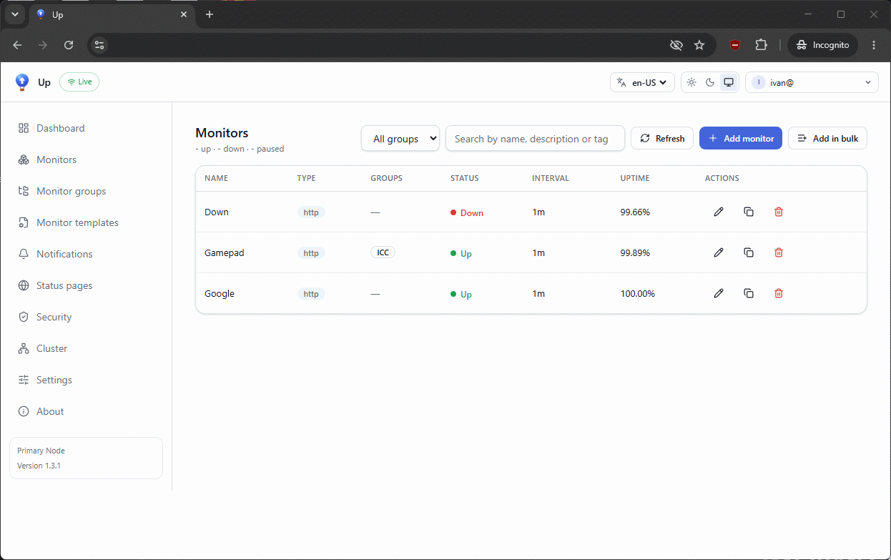
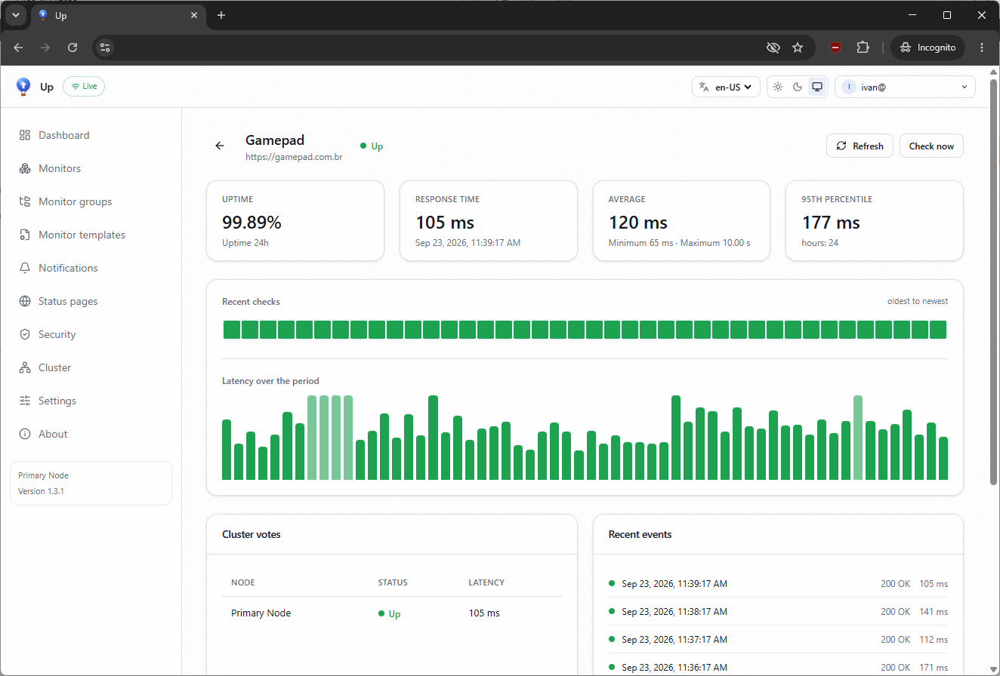
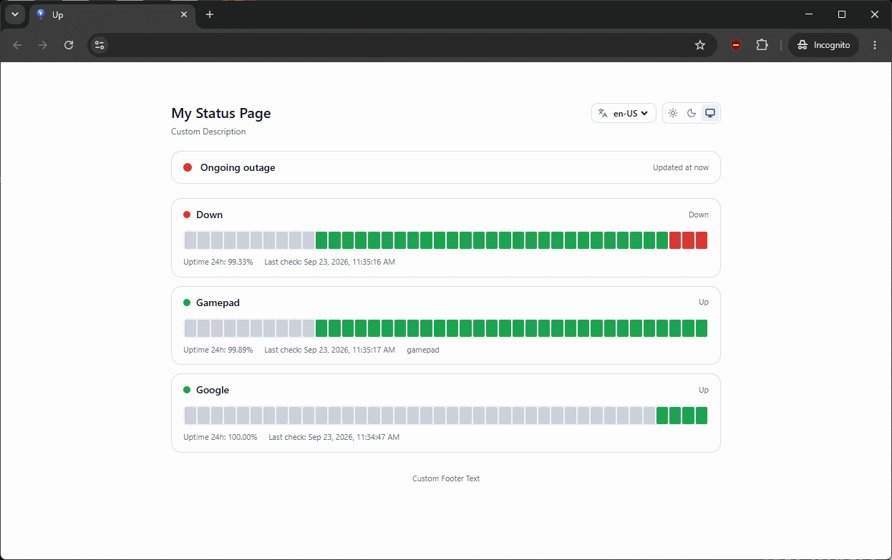

<div align="center">


# Up

**Minimalist, cluster-ready uptime monitoring.**

One Go binary - hosts its own Vue 3 dashboard, writes to your external
MariaDB/MySQL, watches HTTP(s), Keyword, TCP and DNS targets, and runs as a
cluster of nodes that vote on the real status.

<!-- buttons -->
[](https://github.com/ivancarlosti/up/stargazers)
[](https://github.com/sponsors/ivancarlosti)
[](https://github.com/sponsors/ivancarlosti)
[](https://github.com/ivancarlosti/up/releases)
[](https://github.com/ivancarlosti/up/pulse)
[](https://github.com/ivancarlosti/up/issues)  
[](LICENSE)
[](https://github.com/ivancarlosti/up/commits)
[](https://github.com/ivancarlosti/up/security)
[](https://github.com/ivancarlosti/up?tab=coc-ov-file)
<!-- endbuttons -->

</div>

## Features

| | |
|---|---|
| **Monitors** | HTTP(s) (method, encoding, body, headers, basic/bearer auth, redirects, accepted status codes, ignore TLS), HTTP(s) Keyword (invert, case sensitive), TCP (send/expect), DNS (A/AAAA/CNAME/MX/TXT/NS/SOA through a chosen resolver, invert check) |
| **Scheduling** | one worker per monitor, per-monitor interval, timeout, retries with a `pending` phase and a re-notification interval |
| **Dashboard** | live status via WebSocket, 24 h uptime, latency, heartbeat bars, per-node breakdown, monitor detail with statistics and event log |
| **Groups & clones** | named groups of monitors (filter, shallow/deep clone), monitor clone, groups drive the status pages |
| **Templates & bulk** | reusable monitor templates, add monitors by pasting `name,url` (per row report, duplicates skipped) and a bulk edit with a diff preview |
| **Certificates** | a `ssl` type plus certificate watching on any https monitor: validity badge, free thresholds (`7,6,5,30`) and daily `cert_expiring`/`cert_expired` reminders |
| **Notifications** | SMTP and Webhook through the [shoutrrr](https://github.com/nicholas-fedor/shoutrrr) engine, custom webhook body template, delivery history, test button |
| **Authentication** | `none`, single `account` (with optional reCAPTCHA) or `keycloak` OIDC (Authorization Code + PKCE) with an e-mail/domain allow list |
| **Cluster** | several nodes on the same database, join with a private key, node liveness (offline after 2 min), `ANY_NODE_FAILS` / `ALL_NODES_FAIL` / `QUORUM` voting, `PRIMARY_ONLY` / `ANY_WITH_LOCK` notification sender |
| **Public status pages** | per-slug pages with theme, monitor selection, uptime/charts and a README badge |
| **Public REST API** | scoped bearer tokens (`read`/`write`), IP allow/deny rules, rate limiting |
| **i18n & theme** | en-US, pt-BR, es-MX and light/dark/system in the header, configurable default for new visitors |

## Quick start (Docker + external MariaDB)

```bash
cp docker/.env.example docker/.env     # set APP_URL and the DB credentials

docker compose -f docker/docker-compose.yml up -d
docker compose -f docker/docker-compose.yml logs -f up
```

The compose file uses `ghcr.io/ivancarlosti/up:latest` and reaches your database
through `host.docker.internal` (`extra_hosts: host.docker.internal:host-gateway`).
**There is no database service**: Up always connects to an external
MariaDB/MySQL.

The published port follows `APP_PORT` in `docker/.env`: `APP_PORT=3000` publishes
`3000:3000` (default) and `APP_PORT=8080` publishes `8080:8080`. To keep the
container on 3000 but publish another host port, set the optional `HOST_PORT`
(for example `HOST_PORT=80` -> `80:3000`). See
[docs/development.md](docs/development.md#changing-the-published-port).

Database prerequisites:

```sql
CREATE DATABASE up CHARACTER SET utf8mb4 COLLATE utf8mb4_unicode_ci;
CREATE USER 'up'@'%' IDENTIFIED BY 'secret';
GRANT ALL PRIVILEGES ON up.* TO 'up'@'%';
```

Open `http://<host>:3000`, sign in with `ACCOUNT_LOGIN` / `ACCOUNT_PASSWORD` and
create your first monitor.

## Quick start (from source)

```bash
# Go 1.27.1 and Node 24 are required (see docs/development.md for installs)
export PATH="$HOME/.local/go/bin:$HOME/.local/node-v24.21.0-linux-x64/bin:$PATH"

cp docker/.env.example .env
sed -i 's/host.docker.internal/127.0.0.1/' .env

(cd web && npm ci && npm run build)    # once: fills web/dist (embedded)
go run ./cmd/server                    # http://localhost:3000
```

Frontend development with hot reload:

```bash
cd web && npm run dev                  # :5173, proxies /api and the WS to :3000
```

## Configuration

Everything is environment driven; `docker/.env.example` is the complete
reference and the server refuses to start with an incomplete or invalid setup
(printing every problem at once).

The essentials:

```env
APP_URL=https://up.example.com         # canonical public URL
APP_TRUST_PROXY=true                   # behind Traefik/Nginx/Caddy/Cloudflare
APP_PORT=3000                          # inside the container AND published on the host
# HOST_PORT=80                         # optional: publish a different host port

DB_HOST=host.docker.internal           # external database, never in compose
DB_PORT=3306
DB_DATABASE=up
DB_USERNAME=up
DB_PASSWORD=secret
DB_SSL=false

AUTH_METHOD=account                    # none | account | keycloak
ACCOUNT_LOGIN=admin@example.com
ACCOUNT_PASSWORD=admin123

DEFAULT_LOCALE=en-US                   # en-US | pt-BR | es-MX
DEFAULT_THEME=system                   # system | light | dark

CLUSTER_ENABLED=false
NODE_ID=up-node-1
NODE_NAME=Primary Node
CLUSTER_PRIVATE_KEY=                   # generated on the first boot
```

## Public API and status pages

```bash
# create a read-only token (Admin > Security, or the API)
TOKEN=$(curl -s -b cookies.txt -X POST https://up.example.com/api/tokens \
  -H 'Content-Type: application/json' \
  -d '{"name":"ci","scopes":["read"],"expires_in_days":90}' | jq -r .token)

curl -H "Authorization: Bearer $TOKEN" https://up.example.com/api/v1/status
```

```markdown

```

## Documentation

| Document | Content |
|---|---|
| [architecture.md](docs/architecture.md) | components, boot sequence, heartbeat lifecycle, concurrency, where to change what |
| [database.md](docs/database.md) | connection, complete DDL, queries, indexes, migrations, retention |
| [monitors.md](docs/monitors.md) | every monitor type and option, retries, upside down mode |
| [notifications.md](docs/notifications.md) | SMTP, Webhook, template variables, delivery log, troubleshooting |
| [authentication.md](docs/authentication.md) | `none`/`account`/`keycloak`, sessions, allow list, reCAPTCHA |
| [api.md](docs/api.md) | every endpoint with examples and the error code catalogue |
| [public-api.md](docs/public-api.md) | tokens, scopes and recipes for the `/api/v1` surface |
| [status-pages.md](docs/status-pages.md) | public status pages and badges |
| [security.md](docs/security.md) | IP rules, rate limiting, tokens, secrets inventory |
| [clustering.md](docs/clustering.md) | topology, join flow, liveness, voting and sender strategies |
| [reverse-proxy.md](docs/reverse-proxy.md) | Traefik, Nginx, Caddy, Cloudflare Tunnel, WebSocket notes |
| [i18n.md](docs/i18n.md) | languages, resolution order, adding a language |
| [development.md](docs/development.md) | toolchain, local setup, tests, image build, sinks for testing |

## Screenshots

|  | 
|:--:| 
| *Space* |

|  | 
|:--:| 
| *Space* |

|  | 
|:--:| 
| *Space* |

|  | 
|:--:| 
| *Space* |


## Tests

```bash
go test ./...        # checkers, cluster aggregation, IP rules, notification URLs
go vet ./...
cd web && npm run typecheck
```

## License

MIT - see [LICENSE](LICENSE).

<!-- footer -->
---

## 🧑‍💻 Consulting and technical support
* For personal support and queries, please submit a new issue to have it addressed.
* For commercial related questions, please [**contact me**][ivancarlos] for consulting costs.

[cc]: https://docs.github.com/en/communities/setting-up-your-project-for-healthy-contributions/adding-a-code-of-conduct-to-your-project
[contributing]: https://docs.github.com/en/articles/setting-guidelines-for-repository-contributors
[security]: https://docs.github.com/en/code-security/getting-started/adding-a-security-policy-to-your-repository
[support]: https://docs.github.com/en/articles/adding-support-resources-to-your-project
[it]: https://docs.github.com/en/communities/using-templates-to-encourage-useful-issues-and-pull-requests/configuring-issue-templates-for-your-repository#configuring-the-template-chooser
[prt]: https://docs.github.com/en/communities/using-templates-to-encourage-useful-issues-and-pull-requests/creating-a-pull-request-template-for-your-repository
[funding]: https://docs.github.com/en/articles/displaying-a-sponsor-button-in-your-repository
[ivancarlos]: https://ivancarlos.me
