<div align="center">


# Up

**Minimalist, cluster-ready uptime monitoring.**

One Go binary - hosts its own Vue 3 dashboard, writes to your external
MariaDB/MySQL, watches HTTP(s), Keyword, TCP, DNS and SSL targets, keeps an eye on
the expiration of the certificates and domains behind them, and runs as a cluster
of nodes that vote on the real status.

<!-- buttons -->
[](https://github.com/ivancarlosti/up/stargazers)
[](https://github.com/sponsors/ivancarlosti)
[](https://github.com/sponsors/ivancarlosti)
[](https://github.com/ivancarlosti/up/releases)
[](https://github.com/ivancarlosti/up/pulse)
[](https://github.com/ivancarlosti/up/issues)  
[](LICENSE)
[](https://github.com/ivancarlosti/up/commits)
[](https://github.com/ivancarlosti/up/security)
[](https://github.com/ivancarlosti/up?tab=coc-ov-file)
<!-- endbuttons -->

</div>

## Features

| Feature | Description |
|---|---|
| **Monitors** | HTTP(s) (method, encoding, body, headers, basic/bearer auth, redirects, cache buster, accepted status codes, ignore TLS), HTTP(s) Keyword (invert, case sensitive), TCP (send/expect), DNS (A/AAAA/CNAME/MX/TXT/NS/SOA through a chosen resolver, invert check) and SSL (a raw TLS handshake, with an optional SNI); every probe follows the address family chosen for it - the dialer's own choice by default (`auto`), an IPv4/IPv6 rotation that catches a path the other family hides (`alternate`) or a hard pin to one family |
| **Scheduling** | one worker per monitor, per-monitor interval, timeout, retries with a `pending` phase and a re-notification interval |
| **Dashboard** | actionable summary boxes (status counters plus *certificates expiring in 7 days* and *domains expiring in 30 days or expired*) that filter the **shared sortable monitors table** (name, type, group, status, interval, uptime over a selectable period, certificate/domain expiry and a bucketed heartbeat sparkline), live status via WebSocket, per-node breakdown and a monitor detail with statistics and an event log |
| **Uptime window & history** | one global period (24 h / 7 d / 14 d / 30 d) drives the dashboard, the monitors table, the detail page and the heartbeat sparkline, with a per status page override; heartbeat history is pruned by a configurable retention (**180 days by default**, `0` = never) with a preview and a *purge now* button in Admin > Settings |
| **Groups & clones** | named groups of monitors (filter, shallow/deep clone), monitor clone, groups drive the status pages |
| **Templates & bulk** | reusable monitor templates of **every type** (`http`, `keyword`, `tcp`, `dns`, `ssl`), add monitors by pasting `name,target[,type,...]` (per row report, duplicates skipped, a row can override the type of its template), a bulk edit with a diff preview and monitors that **follow** a template (editing it pushes the defaults to every linked monitor; groups and tags stay untouched) |
| **Certificates** | a `ssl` type plus certificate watching on any https monitor: validity badge on the dashboard/detail/admin list, free-form warn thresholds (default `30,14,7,1`) and daily `cert_expiring`/`cert_expired` reminders |
| **Domain expiration** | registry watching for the monitor's domain: RDAP first, per-TLD WHOIS parsers (Admin > TLD/SSL expiration, pre-filled with a verified built-in table for the TLDs without RDAP) and a manual date for the TLDs that publish none (one date per registrable domain, applied the moment it is saved and independent of the watch switch); free-form warn thresholds (default `30,14,7,1`) and daily `domain_expiring`/`domain_expired` reminders |
| **Expiry scheduling** | one daily, configurable-time check for certificates and domains, **deduplicated by target** (many monitors on the same host/domain = one lookup) with an admin rate limit per registry, a target list and a per-target *check now* |
| **Notifications** | SMTP, Webhook, Slack, Discord and Telegram through the [shoutrrr](https://github.com/nicholas-fedor/shoutrrr) engine, custom webhook body template, delivery history, test button |
| **Public status pages** | per-slug public pages with groups, theme, monitor selection, per-page toggles (uptime, charts, tags) and two independent **opt-in expiry badges** (certificate, domain), plus a shields.io style README badge |
| **Authentication** | `none`, single `account` (with optional reCAPTCHA) or `keycloak` OIDC (Authorization Code + PKCE) with an e-mail/domain allow list |
| **Cluster** | two modes. **`shared`** (default): several nodes on the same external database, join with a private key, node liveness (offline after 2 min), `ANY_NODE_FAILS` / `ALL_NODES_FAIL` / `QUORUM` voting and `PRIMARY_ONLY` / `ANY_WITH_LOCK` notification sender. **`federated`**: one database per node, the configuration, the votes and the notification ownership synchronised over the signed peer API (`CLUSTER_PEER_API`), with a derived leader, a notification election (`leader`/`hash`/`origin`), `run_on=some`, opt-in channel/settings/session-secret sync and push. See [clustering.md](docs/clustering.md) and [clustering-modes.md](docs/clustering-modes.md) |
| **Public REST API** | scoped bearer tokens (`read`/`write`), IP allow/deny rules, rate limiting |
| **i18n & theme** | en-US, pt-BR, es-MX, fr-FR, zh-CN, hi-IN, ar-SA (with RTL), light/dark/system and a 12/24-hour clock preference, with configurable defaults for new visitors |

## Quick start (Docker + external MariaDB)

```bash
cp docker/.env.example docker/.env     # set APP_URL and the DB credentials

docker compose -f docker/docker-compose.yml up -d
docker compose -f docker/docker-compose.yml logs -f up
```

The compose file uses `ghcr.io/ivancarlosti/up:latest` and reaches your database
through `host.docker.internal` (`extra_hosts: host.docker.internal:host-gateway`).
**This file declares no database service**: Up connects to an external
MariaDB/MySQL (the bundle described below is the self-contained alternative).

The published port follows `APP_PORT` in `docker/.env`: `APP_PORT=3000` publishes
`3000:3000` (default) and `APP_PORT=8080` publishes `8080:8080`. To keep the
container on 3000 but publish another host port, set the optional `HOST_PORT`
(for example `HOST_PORT=80` -> `80:3000`). See
[docs/development.md](docs/development.md#changing-the-published-port).

Database prerequisites:

```sql
CREATE DATABASE up CHARACTER SET utf8mb4 COLLATE utf8mb4_unicode_ci;
CREATE USER 'up'@'%' IDENTIFIED BY 'secret';
GRANT ALL PRIVILEGES ON up.* TO 'up'@'%';
```

Open `http://<host>:3000`, sign in with `ACCOUNT_LOGIN` / `ACCOUNT_PASSWORD` and
create your first monitor.

## Quick start (Docker bundle with MariaDB included)

`docker/docker-compose-bundle.yml` is the same application plus a MariaDB
container, for a machine that has no database server yet. Inside a compose
network a container is reached by its **service name**, so `DB_HOST` must be the
name of the database service declared there (`mariadb`):

```bash
cp docker/.env.example docker/.env
sed -i 's/^DB_HOST=.*/DB_HOST=mariadb/' docker/.env     # the bundled DB service

docker compose -f docker/docker-compose-bundle.yml up -d
docker compose -f docker/docker-compose-bundle.yml logs -f up
```

The database files live in the `mariadb_data` volume, so they survive restarts;
`docker compose -f docker/docker-compose-bundle.yml down -v` deletes them along
with every monitor, heartbeat and setting. Both compose files are alternatives:
they read the same `docker/.env` and use the same container name (`up`).

## Quick start (from source)

```bash
# Go 1.27.1 and Node 24 are required (see docs/development.md for installs)
export PATH="$HOME/.local/go/bin:$HOME/.local/node-v24.21.0-linux-x64/bin:$PATH"

cp docker/.env.example .env
sed -i 's/host.docker.internal/127.0.0.1/' .env

(cd web && npm ci && npm run build)    # once: fills web/dist (embedded)
go run ./cmd/server                    # http://localhost:3000
```

Working on the frontend or on the Go code? [docs/development.md](docs/development.md)
has the toolchain, the hot-reload dev server (`npm run dev`) and the contributor
workflow.

## Configuration

Everything is environment driven; `docker/.env.example` is the complete
reference and the server refuses to start with an incomplete or invalid setup
(printing every problem at once).

The essentials:

```env
APP_URL=https://up.example.com         # canonical public URL
APP_TRUST_PROXY=true                   # behind Traefik/Nginx/Caddy/Cloudflare
APP_PORT=3000                          # inside the container AND published on the host
# HOST_PORT=80                         # optional: publish a different host port

DB_HOST=host.docker.internal           # external database, never in compose
# DB_HOST=mariadb                      # bundled database (docker-compose-bundle.yml)
DB_PORT=3306
DB_DATABASE=up
DB_USERNAME=up
DB_PASSWORD=secret
DB_SSL=false

AUTH_METHOD=account                    # none | account | keycloak
ACCOUNT_LOGIN=admin@example.com
ACCOUNT_PASSWORD=admin123

DEFAULT_LOCALE=en-US                   # en-US | pt-BR | es-MX | fr-FR | zh-CN | hi-IN | ar-SA
DEFAULT_THEME=system                   # system | light | dark

CLUSTER_ENABLED=false
CLUSTER_MODE=shared                    # shared (same database) | federated (one database per node)
CLUSTER_PEER_API=false                 # signed node to node API + ping loop (required by federated)
NODE_ID=up-node-1
NODE_NAME=Primary Node
CLUSTER_PRIVATE_KEY=                   # generated on the first boot

# retention
# HEARTBEAT_RETENTION_DAYS=30          # fallback of a deployment that never opened Admin > Settings, where the live value defaults to 180 days (0 = never purge)
# NOTIFICATION_LOG_RETENTION_DAYS=90   # prune the delivery history (environment only, disabled by default)
```

### Network egress (WHOIS, RDAP, DNS)

The expiry job talks to the registries directly, so the container needs:

| Port | Used for |
|---|---|
| **TCP 43** | WHOIS: `whois.iana.org` and the per-TLD registry servers |
| **TCP 443** | RDAP (`data.iana.org`, `rdap.org`, the registry bases) and your HTTPS monitors |
| **UDP/TCP 53** | DNS |

Two things are worth knowing when a look-up fails:

* **A Docker network is IPv4-only by default**, so the container has **no IPv6
  route at all** even when the machine running Docker has one: every registry —
  or CDN or firewall — that answers only over IPv6 becomes unreachable, and the
  symptom is the IPv4 dial of the other family timing out after the whole
  `timeout_seconds` (`dial tcp 52.37.99.5:43: i/o timeout`). The app cannot work
  around that and does not pretend to: it dials both families on its own (Go's
  happy eyeballs) and, when the dial fails, the error lists every resolved
  address with its own error — an address family cannot create a route.
* An egress firewall that only allows 80/443 breaks WHOIS (port 43) while RDAP
  keeps working, which looks like "the rule for this TLD is wrong".

The supported fix for a registry that only answers over IPv6 — `.pt`
(`whois.dns.pt`) is one — is to run the container with the host network, so it
uses the host's IPv6 route (Linux engines only). In Compose that means replacing
`ports`, `extra_hosts` and `networks` on the `up` service with one line:

```yaml
services:
  up:
    network_mode: host
```

The database is then reached where the host sees it (`DB_HOST=127.0.0.1`; with
the bundle, uncomment the `DB_HOST_PORT` port of the `mariadb` service, which
stays on the default bridge network), and `APP_PORT`/`HOST_PORT` no longer apply.

Enabling IPv6 in the engine is the alternative that also covers every other
container (`/etc/docker/daemon.json`: `{"ipv6": true, "fixed-cidr-v6":
"fd00::/80", "ip6tables": true}`, then restart Docker), at the cost of touching
the configuration of the whole host.
Docker Desktop: Settings > Resources > Network > Enable IPv6.

A failed look-up is self-describing: the error lists every resolved address with
its own error and, when the unreachable addresses are the IPv6 ones, it names the
fix above. `docker/.env.example` carries the same note with the recipes used to
confirm the route from inside the container.

## Public API and status pages

```bash
# create a read-only token (Admin > Security, or the API)
TOKEN=$(curl -s -b cookies.txt -X POST https://up.example.com/api/tokens \
  -H 'Content-Type: application/json' \
  -d '{"name":"ci","scopes":["read"],"expires_in_days":90}' | jq -r .token)

curl -H "Authorization: Bearer $TOKEN" https://up.example.com/api/v1/status
```

```markdown

```

## Documentation

| Document | Content |
|---|---|
| [architecture.md](docs/architecture.md) | components, boot sequence, heartbeat lifecycle, concurrency, where to change what |
| [database.md](docs/database.md) | connection, complete DDL, queries, indexes, migrations, retention |
| [monitors.md](docs/monitors.md) | every monitor type and option, retries, upside down mode |
| [notifications.md](docs/notifications.md) | SMTP, Webhook, Slack, Discord, Telegram, template variables, delivery log, troubleshooting |
| [authentication.md](docs/authentication.md) | `none`/`account`/`keycloak`, sessions, allow list, reCAPTCHA |
| [api.md](docs/api.md) | every endpoint with examples and the error code catalogue |
| [public-api.md](docs/public-api.md) | tokens, scopes and recipes for the `/api/v1` surface |
| [status-pages.md](docs/status-pages.md) | public status pages and badges |
| [security.md](docs/security.md) | IP rules, rate limiting, tokens, secrets inventory |
| [clustering.md](docs/clustering.md) | topology, join flow, liveness, voting and sender strategies |
| [clustering-modes.md](docs/clustering-modes.md) | cluster modes: `shared` vs `federated` (one database per node), sync protocol, identity, voting, notification election |
| [reverse-proxy.md](docs/reverse-proxy.md) | Traefik, Nginx, Caddy, Cloudflare Tunnel, WebSocket notes |
| [i18n.md](docs/i18n.md) | languages, resolution order, adding a language |
| [development.md](docs/development.md) | toolchain, local setup, image build, contributor workflow and troubleshooting |

## Screenshots

Every image below comes from a seeded local instance - nothing is mocked up, and
the `Live` badge is the real WebSocket connection (regenerate them with
`npm run seed:demo && npm run shots:readme` in `web/`, see
[docs/development.md](docs/development.md#61-screenshots-and-layout-checks)).

| 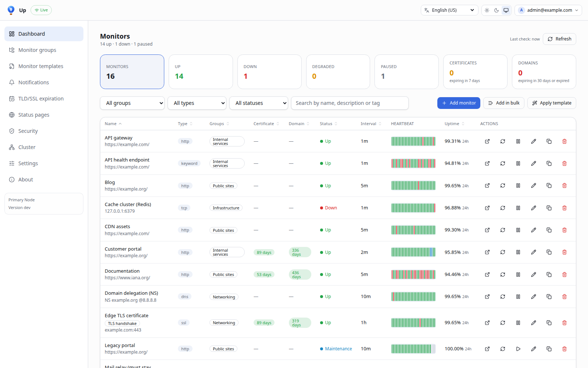 | 
|:--:| 
| *Main dashboard panel: counters, status, uptime and heartbeat bars*
(benchmark: 7 seconds to load 1600 monitors) |

| 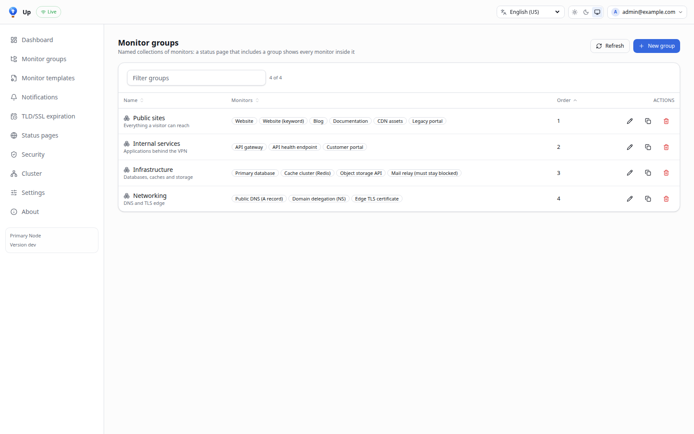 | 
|:--:| 
| *Monitor groups: named collections of monitors, reused by status pages* |

| 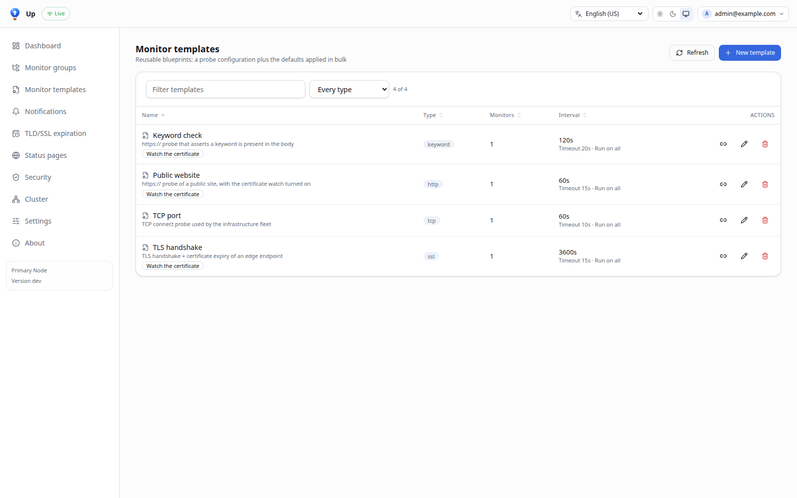 | 
|:--:| 
| *Monitor templates* |

| 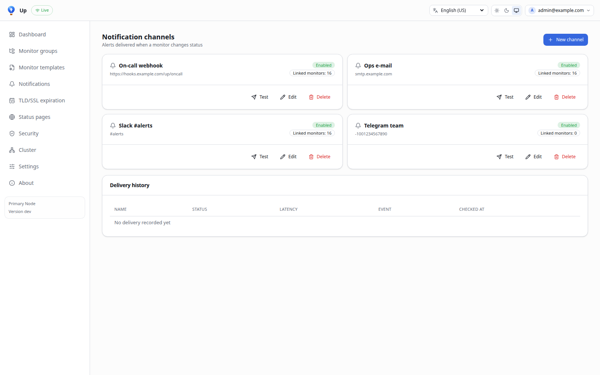 | 
|:--:| 
| *Notification channels and delivery history* |

| 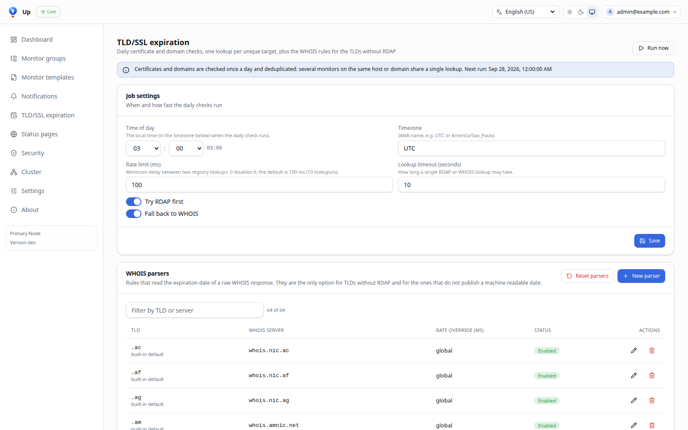 | 
|:--:| 
| *TLD and SSL expiration: the daily job settings and the WHOIS parsers for TLDs without RDAP* |

| 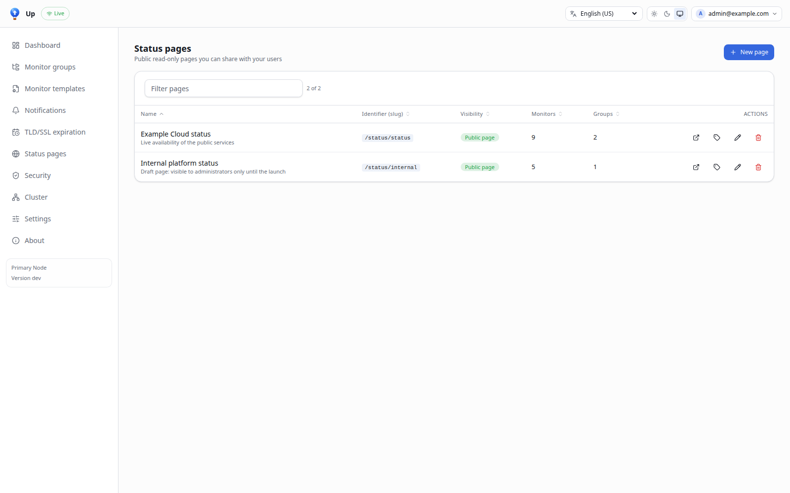 | 
|:--:| 
| *Status pages* |

| 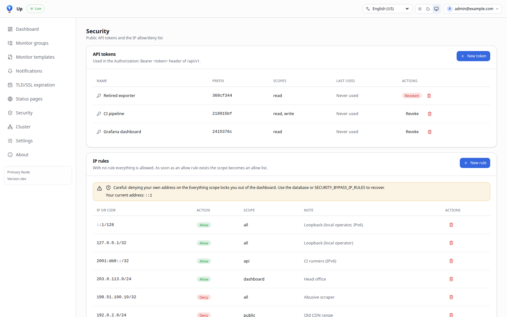 | 
|:--:| 
| *Security: public API tokens and the IP allow/deny list* |

| 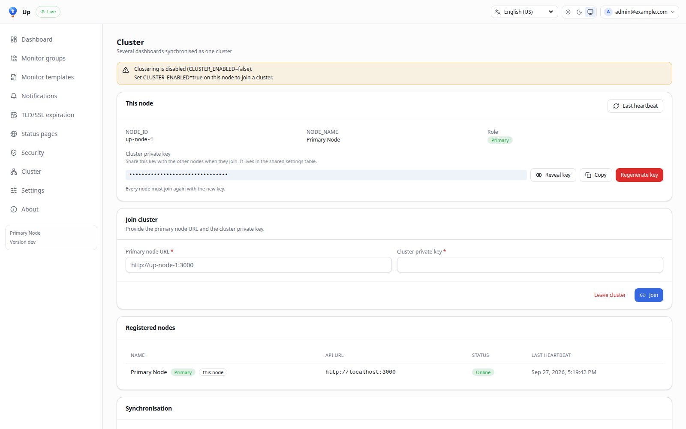 | 
|:--:| 
| *Cluster: this node, the join flow and the registered nodes* |

| 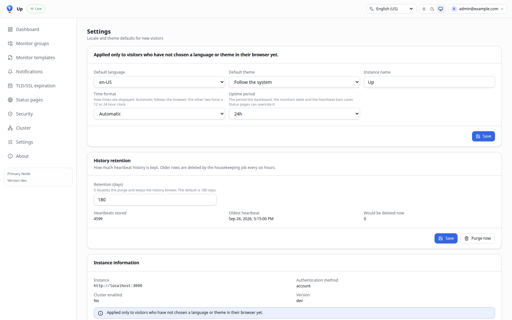 | 
|:--:| 
| *Settings* |

| 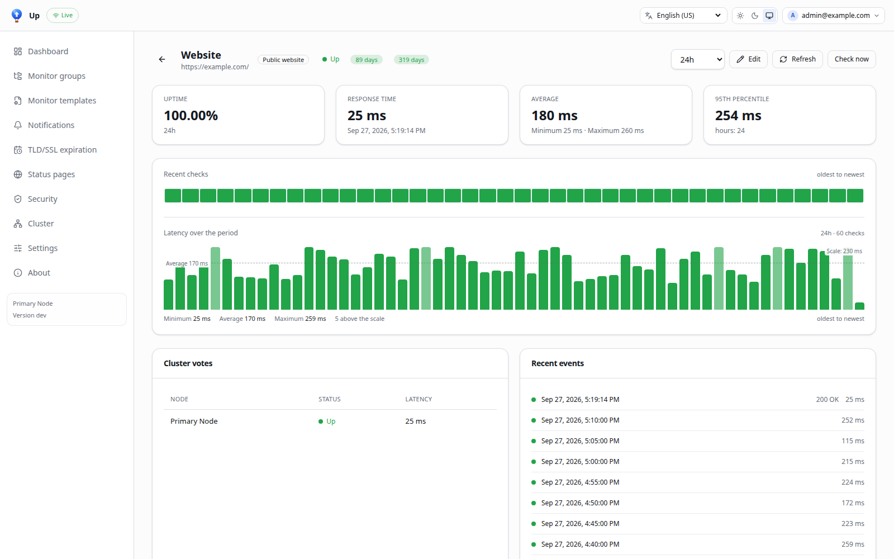 | 
|:--:| 
| *Monitor detail: uptime, response time, latency chart, cluster votes and recent events* |

| 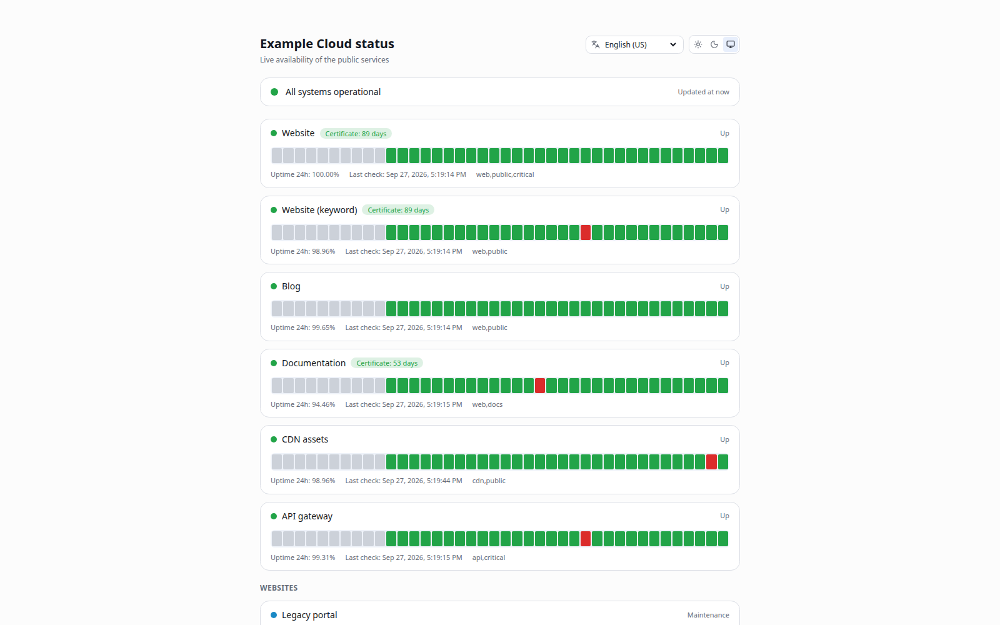 | 
|:--:| 
| *Public status page* |

## License

MIT - see [LICENSE](LICENSE).

<!-- footer -->
---

## 🧑‍💻 Consulting and technical support
* For personal support and queries, please submit a new issue to have it addressed.
* For commercial related questions, please [**contact me**][ivancarlos] for consulting costs.

[cc]: https://docs.github.com/en/communities/setting-up-your-project-for-healthy-contributions/adding-a-code-of-conduct-to-your-project
[contributing]: https://docs.github.com/en/articles/setting-guidelines-for-repository-contributors
[security]: https://docs.github.com/en/code-security/getting-started/adding-a-security-policy-to-your-repository
[support]: https://docs.github.com/en/articles/adding-support-resources-to-your-project
[it]: https://docs.github.com/en/communities/using-templates-to-encourage-useful-issues-and-pull-requests/configuring-issue-templates-for-your-repository#configuring-the-template-chooser
[prt]: https://docs.github.com/en/communities/using-templates-to-encourage-useful-issues-and-pull-requests/creating-a-pull-request-template-for-your-repository
[funding]: https://docs.github.com/en/articles/displaying-a-sponsor-button-in-your-repository
[ivancarlos]: https://ivancarlos.me
