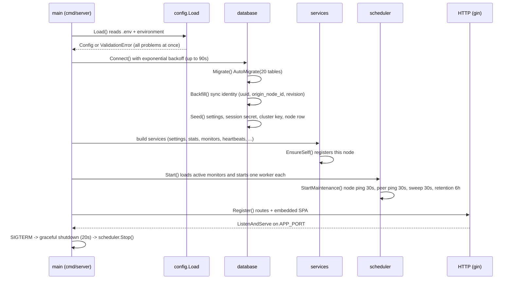
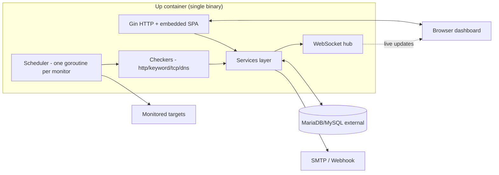
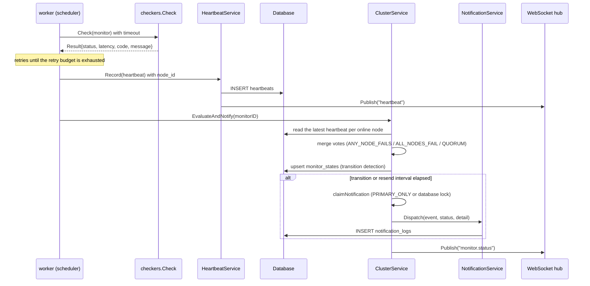

# Up - Architecture

> Audience: engineers and AI agents maintaining this repository. This document
explains **what runs where, why it is built this way and which file to touch**
for a given change. It is meant to be readable without opening the code.

## 1. What Up is

Up is a minimalist, cluster-ready uptime monitor:

- **Single binary**: the Go backend embeds the compiled Vue 3 frontend
  (`web/dist`), so the Docker image ships one executable and no web server.
- **External database only**: MariaDB/MySQL lives outside the container
  (`DB_HOST`, default `host.docker.internal`). The compose file never declares a
  database service.
- **Cluster ready**: two modes chosen with `CLUSTER_MODE`. `shared` (default)
  makes several Up instances share the same database, each running its own
  scheduler and writing its own heartbeats (`node_id`), while the dashboard
  aggregates them ([clustering.md](clustering.md)). `federated` gives every node
  its own database and synchronises the configuration, the votes and the
  notification ownership over a signed peer API
  ([clustering-modes.md](clustering-modes.md)); the synchronisation identity it
  needs (a global `uuid` per row) is in the schema either way.
- **Authentication is environment driven**: `none`, `account` (single account)
  or `keycloak` (OIDC + e-mail/domain allow list).
- **Notifications** use [shoutrrr](https://github.com/nicholas-fedor/shoutrrr) as
  the delivery engine; the UI exposes SMTP and Webhook.

## 2. Repository layout

```
cmd/server/          entry point (config -> db -> services -> scheduler -> HTTP)
internal/
  api/               JSON response helpers shared by handlers and middlewares
  checkers/          probe engines: HTTP, Keyword, TCP, DNS
  config/            env loading + validation (fail fast, aggregated report)
  database/          connection with retry, GORM AutoMigrate, first boot seed
  handlers/          HTTP layer: routes, payload binding, JSON responses
  i18n/              stable error codes returned by the API
  middleware/        request id, real IP, logging, security headers, CORS,
                     recovery, IP rules, rate limit, session/token auth
  models/            GORM entities, enums, monitor configuration structs
  notify/            shoutrrr wrapper: SMTP + Webhook (+ body templating)
  scheduler/         per monitor goroutines, retries, maintenance loops
  services/          business rules (monitors, stats, notifications, cluster,
                     status pages, tokens, IP rules, sessions, settings)
  utils/             crypto (HMAC, hashes, tokens), IP/CIDR helpers
  version/           build metadata injected with -ldflags
web/                 Vue 3 + Vite + TypeScript + Tailwind frontend
  embed.go           //go:embed all:dist -> Dist()/Available()
  src/locales/       en-US.json, pt-BR.json, es-MX.json
docker/              docker-compose.yml (external DB), docker-compose-bundle.yml
                     (MariaDB included), .env, .env.example (nothing else)
docs/                this documentation set
Dockerfile           three stages: web build -> go build -> alpine runtime
```

## 3. Boot sequence



Everything that can fail at boot (missing variable, unreachable database,
invalid locale) aborts the process with a readable message instead of surfacing
later as a runtime error.

## 4. Runtime topology (single node)



## 5. The lifecycle of one heartbeat



Key idea: **the checker never talks to the notifier**. The scheduler stores a
heartbeat, then the cluster service decides the aggregated status, and that
transition triggers notifications. Single-node and cluster behaviour share the
same code path, and the aggregated state lives in the shared database
(`monitor_states`).

## 6. Data ownership and synchronisation

| Data | Owner | Shared between nodes? |
|---|---|---|
| `monitors`, `notifications`, links | Any node (admin API) | Yes (same database) |
| `heartbeats` | The node that executed the check (`node_id`) | Yes (aggregated by readers) |
| `monitor_states` | The node that observed the transition (first writer wins) | Yes (transition de-duplication) |
| `notification_locks` | The node that claimed the event | Yes (single sender election) |
| `nodes`, `cluster_settings` | Primary node (or any admin) | Yes |
| `settings` (locale/theme/session secret/cluster key) | Any node | Yes |
| `ip_rules`, `api_tokens`, `status_pages` | Any node | Yes |

Because everything lives in the shared database, no message broker, cache or
service discovery is required.

## 7. Concurrency model

- **One goroutine per monitor** (`internal/scheduler/worker.go`). Each worker
  keeps a `time.Ticker` for its own interval plus a `trigger` channel for the
  "check now" action; the first tick is jittered (0-3 s) so a restart does not
  fire every monitor at the same instant.
- **Global concurrency cap** `SCHEDULER_MAX_CONCURRENT` (default 20) enforced by
  a semaphore channel, bounding the number of simultaneous sockets.
- **Expiry job** (ticked every minute, run once a day at the time configured in
  *Admin > TLD/SSL expiration*, `services.ExpiryService`): it refreshes the TLS
  certificates and the domain registrations of the watched targets, with a single
  lookup per **deduplicated** target, and sends the reminders that are due. A
  day-bucket lock elects one node of a cluster. The certificate a probe reads is
  still stored and evaluated immediately (a new monitor pointed at an expired
  certificate warns at once), but the identical rewrites are skipped: the row is
  written at most once a day. At boot an **evaluation-only** pass
  (`ExpiryService.Evaluate`) ages what is already stored without opening a socket,
  so a monitor whose target is unreachable still gets its reminder.
- **Reconciliation** happens through a command channel (`upsert`, `remove`,
  `reload`, `checkNow`) so HTTP handlers never mutate the worker map directly,
  plus a periodic pass (`SCHEDULER_RECONCILE_SECONDS`, default 30 s) that compares
  the running workers with the shared database: a monitor created (or deleted,
  paused, moved with `run_on`) on another node starts (or stops) here without a
  restart. Both paths share one plan (`internal/scheduler/reconcile.go`) and one
  lock, so a monitor never ends up with two goroutines.
- **WebSocket hub** owns the client registry; services publish through the
  `services.EventPublisher` interface, which keeps the service layer free of any
  WebSocket dependency.
- **Shutdown**: the signal context cancels the workers and the maintenance loop,
  then the HTTP server drains (20 s budget).

## 8. Configuration reference

All variables, their defaults and validation rules live in
`docker/.env.example` (the canonical file). Grouped summary:

| Group | Variables |
|---|---|
| App / proxy | `APP_URL`, `APP_TRUST_PROXY`, `APP_PORT` |
| Docker publish (compose only) | `HOST_PORT` (optional; published host port, defaults to `APP_PORT`) |
| Docker bundle (compose only) | `DB_ROOT_PASSWORD` (root password of the bundled MariaDB), `DB_HOST_PORT` (optional; publishes the bundled database on the host) |
| Database | `DB_HOST`, `DB_PORT`, `DB_DATABASE`, `DB_USERNAME`, `DB_PASSWORD`, `DB_SSL` |
| Auth | `AUTH_METHOD`, `ACCOUNT_LOGIN`, `ACCOUNT_PASSWORD`, `RECAPTCHA_CLIENTID`, `RECAPTCHA_CLIENTSECRET`, `KEYCLOAK_*` |
| Defaults | `DEFAULT_LOCALE`, `DEFAULT_THEME` |
| Cluster | `CLUSTER_ENABLED`, `CLUSTER_MODE` (`shared`\|`federated`), `CLUSTER_PEER_API`, `CLUSTER_LEADER_SETTLE_SECONDS`, `NODE_ID`, `NODE_NAME`, `CLUSTER_PRIVATE_KEY` |
| Cluster (federated sync) | `CLUSTER_LEADER_ELECTION`, `CLUSTER_LEADER_NODE_ID`, `CLUSTER_NOTIFY_ELECTION`, `CLUSTER_SYNC_SECONDS`, `CLUSTER_SYNC_BATCH`, `CLUSTER_SYNC_MANIFEST_SECONDS`, `CLUSTER_SYNC_TOMBSTONE_DAYS`, `CLUSTER_SYNC_NOTIFICATIONS`, `CLUSTER_SYNC_SETTINGS`, `CLUSTER_SYNC_SESSION_SECRET`, `CLUSTER_SYNC_PUSH`, `CLUSTER_INSECURE_SKIP_VERIFY` |
| Tuning (optional) | `LOG_LEVEL`, `SCHEDULER_MAX_CONCURRENT`, `SCHEDULER_RECONCILE_SECONDS`, `HEARTBEAT_RETENTION_DAYS`, `NOTIFICATION_LOG_RETENTION_DAYS`, `SESSION_TTL_HOURS`, `SECURITY_BYPASS_IP_RULES`, `SECURITY_LOGIN_RATE_LIMIT`, `SECURITY_PUBLIC_RATE_LIMIT` |

Validation lives in `internal/config/validate.go`; the aggregated error type is
`config.ValidationError` (printed by `cmd/server/main.go`, exit code 2).

## 9. Error contract

Every failure answers with a stable code that the frontend translates:

```json
{ "code": "ERR_MONITOR_CONFIG_INVALID", "message": "config.url is required for HTTP and Keyword monitors" }
```

- Codes are declared in `internal/i18n/errors.go`.
- Translations live in `web/src/locales/*.json` under the `errors` namespace and
  `web/src/lib/errors.ts` maps one to the other.
- Adding a code means touching both places (and `docs/api.md`); locale parity can
  be verified with the snippet in `docs/i18n.md`.

## 10. Where to change what

| Goal | File(s) |
|---|---|
| Add an environment variable | `internal/config/config.go`, `internal/config/validate.go`, `docker/.env.example`, this document |
| Add a monitor type | `internal/models/enums.go`, `internal/models/monitor_config.go`, `internal/checkers/*`, `internal/models/monitor_validate.go`, `web/src/components/monitors/MonitorForm.vue` |
| Change the aggregation rules | `internal/services/cluster_evaluate.go` (`AggregateVotes`) |
| Change who sends notifications | `internal/services/cluster_notify.go` (`claimNotification`) |
| Add an API endpoint | `internal/handlers/router*.go` (+ handler), `docs/api.md` |
| Change notification payloads | `internal/notify/message.go`, `internal/notify/urls.go` |
| Add a UI string | `web/src/locales/*.json` (three files) |
| Change monitor validation | `internal/models/monitor_validate.go`, `internal/services/monitor_validate.go` |

## 11. Performance notes

- Heartbeat volume: one row per monitor per interval per node. At 60 s a single
  monitor produces ~1 440 rows/day per node; use `HEARTBEAT_RETENTION_DAYS` to
  bound growth (purge every 6 h).
- The dashboard uses three grouped queries (`Windows`, `LatestPerMonitor`,
  `LatestPerNode`) plus one query per monitor for the bars (`Series`) - never a
  query per heartbeat.
- The 24 h/7 d/30 d uptime figures come from a single aggregate query using
  conditional `SUM(CASE ...)` expressions.
- IP rules are cached in memory for 10 s; writes invalidate the cache.
- `notification_locks` rows are tiny and only meaningful for a 60 s window.
