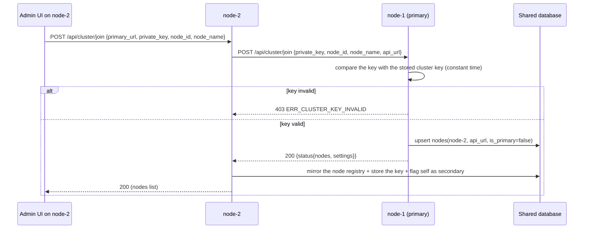
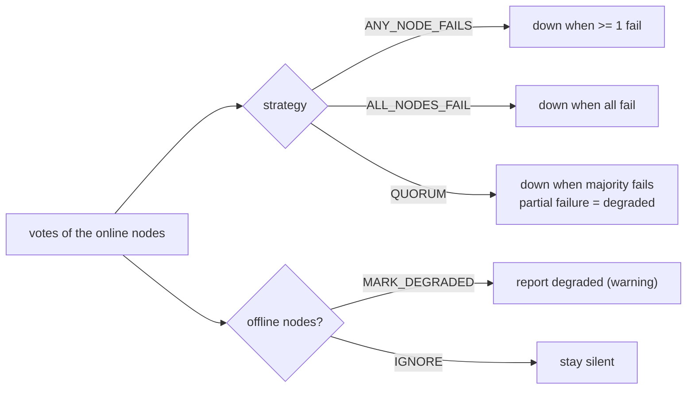

# Up - Clustering

> Several Up instances ("nodes") monitoring the same targets and showing the
> same dashboard. There is **no broker, no shared cache and no service
> discovery**: every node points to the **same external MariaDB/MySQL database**,
> which is what keeps monitors, heartbeats, aggregated state and notification
> decisions synchronised.

> **Two modes.** `CLUSTER_MODE=shared` (the default, and what this document
> describes) means every node points at the **same external MariaDB/MySQL
> database**, which is what keeps monitors, heartbeats, aggregated state and
> notification decisions synchronised. `CLUSTER_MODE=federated` gives every node
> **its own** database and synchronises the configuration, the votes and the
> notification ownership over a signed peer API; it is the reference in
> [clustering-modes.md](clustering-modes.md).

## 1. Topology

```mermaid
flowchart TB
  subgraph Cluster["Up cluster (all nodes share one database)"]
    N1["up-node-1 (primary)\nAPP_URL=http://up-node1:3000"]
    N2["up-node-2 (secondary)\nAPP_URL=http://up-node2:3000"]
    N3["up-node-N ..."]
  end
  DB[("External MariaDB/MySQL\nmonitors, heartbeats(node_id),\nmonitor_states, notification_locks, nodes")]
  N1 -->|scheduler writes heartbeats| DB
  N2 -->|scheduler writes heartbeats| DB
  N3 -->|scheduler writes heartbeats| DB
  N1 <-.->|join handshake + liveness| N2
  N2 <-.->|join handshake + liveness| N3
  U["Operator browser"] --> N1
  U --> N2
  EMAIL[SMTP / Webhook] <-- notifications (elected sender) --- N1
  EMAIL <-- notifications (elected sender) --- N2
```

## 2. Required configuration

| Variable | Node 1 | Node 2 | Meaning |
|---|---|---|---|
| `CLUSTER_ENABLED` | `true` | `true` | enables the cluster features on that node |
| `CLUSTER_MODE` | `shared` | `shared` | `shared` (this document) or `federated` (one database per node) — see [clustering-modes.md](clustering-modes.md); federated also requires `CLUSTER_PEER_API=true` |
| `CLUSTER_PEER_API` | `false` | `false` | optional: enables the signed node to node API and the peer ping loop. It also works in shared mode, where it cross-checks liveness over HTTP instead of trusting the shared row |
| `NODE_ID` | `up-node-1` | `up-node-2` | **unique** per node, becomes `heartbeats.node_id` |
| `NODE_NAME` | `Primary Node` | `Node 2` | display name |
| `APP_URL` | `http://up-node1:3000` | `http://up-node2:3000` | must be **reachable from the other nodes** (it is stored as `nodes.api_url`) |
| `CLUSTER_PRIVATE_KEY` | empty | empty | generated on the first boot and visible in Admin > Cluster |
| `DB_*` | same values | same values | the same database is mandatory |

> `APP_URL` is also the public URL used for links, CORS and the OIDC redirect.
> When the UI is published on a public domain, put the public URL in `APP_URL`
> and make sure the nodes can still reach each other (internal DNS name or a
> different port mapping). The value stored in `nodes.api_url` is exactly
> `APP_URL`, so a node must be able to reach the other nodes through it.

## 3. Joining a node (Admin > Cluster > Join cluster)



API equivalent (the same endpoint accepts both flavours):

```bash
# on the joining node, with its own session cookie
curl -X POST http://localhost:3001/api/cluster/join \
  -H 'Content-Type: application/json' -b cookies.txt \
  -d '{"primary_url":"http://up-node1:3000","private_key":"<key from Admin > Cluster>","node_id":"up-node-2","node_name":"Node 2"}'

# server to server (primary side), authenticated with the shared key
curl -X POST http://up-node1:3000/api/cluster/join \
  -H 'Content-Type: application/json' -H 'X-Cluster-Key: <key>' \
  -d '{"private_key":"<key>","node_id":"up-node-2","node_name":"Node 2","api_url":"http://up-node2:3000"}'
```

The UI flavour requires a dashboard session because it performs a server side
HTTP request to the URL the operator typed (SSRF guard). The node-to-node
flavour is authenticated by the cluster private key.

`primary_url` has to be a plain `http(s)://host[:port][/path]` URL of a node:
the value is validated before the outbound request (which carries the cluster
private key) is sent, credentials and any other scheme are rejected, and a
redirect is reported instead of being followed, so the key never reaches a host
the operator did not name.

### Leaving

`POST /api/cluster/leave` with `{"node_id":"up-node-2"}` (empty body = the node
running the request). If the leaving node was the primary, the oldest remaining
node is promoted automatically.

### Exactly one primary

The primary role is claimed inside one transaction that takes a locking read on
the single `cluster_settings` row, so two nodes booting at the same instant
cannot both see "there is no primary yet" and both register themselves. A cluster
with two primaries would send every notification twice under `PRIMARY_ONLY` and
run each `run_on=primary` monitor on two nodes at once.

The same transaction **repairs** a database that already ended up with more than
one primary (possible with the racy claim of earlier releases): the oldest node
keeps the role, the rest are demoted, and the boot log reports it:

```
WARN more than one primary node found: keeping the oldest and demoting the rest  kept=up-node-1 demoted=1
```

`is_primary` is still a stored column (federated mode derives the role instead,
see [clustering-modes.md](clustering-modes.md)), but it is now written by
one code path (`database.ClaimSelf`) instead of two.

## 4. Liveness and the offline rule

Each node refreshes `nodes.last_heartbeat` every 30 s (the same code path used by
`POST /api/cluster/heartbeat`). A sweeper runs every 30 s and applies:

| Age of `last_heartbeat` | `nodes.status` | Effect on the voting |
|---|---|---|
| < 60 s | `online` | votes normally |
| 60 s - 120 s | `degraded` | still votes (late) |
| >= 120 s | `offline` | **excluded** from the vote |

An offline node never makes a monitor go down by itself: with
`node_unavailable_strategy=MARK_DEGRADED` the monitor is reported as `degraded`
(a warning) while the remaining nodes still decide up/down; with `IGNORE` the
absence is silent and only the remaining nodes vote.

## 5. Failure strategies (Admin > Cluster > failure_strategy)

Votes are the latest heartbeat of every **online** node whose heartbeat is fresh
(freshness = `max(2 x interval, 120 s)`).

| Strategy | Down when | Notes |
|---|---|---|
| `ANY_NODE_FAILS` | **any** online node reports a failure | fastest alert, most sensitive to a single node's network |
| `ALL_NODES_FAIL` (default) | **every** online node reports a failure | resilient to one node's local network problem |
| `QUORUM` | the **majority** of online nodes fail | a partial failure is reported as `degraded` |

The pure implementation is `AggregateVotes` in
`internal/services/cluster_evaluate.go` and it is covered by unit tests
(`cluster_evaluate_test.go`).



`run_on` decides **which** nodes vote: `all` (default), `primary` or a single
`node` (paired with `node_id`). Nodes that are not supposed to run a monitor are
excluded from its vote list.

## 6. Notification sender strategy (notification_sender)

Both nodes observe the same transition (the state lives in `monitor_states`), so
the sender must be elected exactly once:

| Strategy | Behaviour |
|---|---|
| `PRIMARY_ONLY` | only the primary node dispatches; a secondary node skips the send |
| `ANY_WITH_LOCK` (default) | any node may send, but `INSERT` into `notification_locks(monitor_id, event, bucket)` with `ON CONFLICT DO NOTHING` elects one sender per 60 s window |

Verified experimentally: with two nodes evaluating the same monitor, each
transition produced exactly **one** e-mail; `notification_logs.node_id` shows the
winning node (which may differ between the DOWN and the UP event).

## 7. Heartbeats and aggregation

- Every node runs its own scheduler and writes heartbeats with its `NODE_ID`.
- The dashboard/detail page shows a **per node breakdown** (`votes`) and the
  aggregated status.
- `monitor_states` holds the aggregated status, the last message/latency and the
  last notification time; it is upserted with `ON DUPLICATE KEY UPDATE`, so the
  first writer wins and the other nodes read the same row.
- Re-notification (`resend_interval_seconds > 0`) is evaluated against
  `monitor_states.notified_at`, so only one node per window repeats the alert.
- **Worker reconciliation**: each node compares its running workers with the
  monitors it is responsible for (active + `run_on`) every
  `SCHEDULER_RECONCILE_SECONDS` (default 30 s, minimum 5). The CRUD handlers can
  only touch the process that served the request (`POST /api/monitors` on node-1
  never reaches node-2's scheduler) and the WebSocket hub is per-process, so this
  periodic pass is what makes a monitor created, edited, paused or deleted on
  another node take effect here **without a restart**. A `run_on` change that
  moves a monitor between nodes is handled the same way, and the log line
  `scheduler reconciled the workers` lists the ids that started and stopped.

## 8. Endpoints

| Method | Path | Purpose |
|---|---|---|
| GET | `/api/cluster/status` | node identity, role, key, settings, node list |
| GET | `/api/cluster/nodes` | registered nodes (with `is_self`) |
| POST | `/api/cluster/join` | join (UI flavour) / register (node flavour) |
| POST | `/api/cluster/leave` | remove a node (promotes a new primary if needed) |
| GET | `/api/cluster/settings` | failure/node/sender strategies |
| PUT | `/api/cluster/settings` | update the strategies |
| GET | `/api/cluster/private-key` | reveal the shared key (admin only) |
| POST | `/api/cluster/private-key/regenerate` | rotate the key |
| POST | `/api/cluster/heartbeat` | refresh this node liveness and list online/offline |

## 9. Operating a cluster

```bash
# Inspect from any node (session required)
curl -s -b cookies.txt http://localhost:3000/api/cluster/status | jq

# Which node produced a given heartbeat?
SELECT node_id, COUNT(*) FROM heartbeats WHERE monitor_id = 6 GROUP BY node_id;

# Who sent the last notifications?
SELECT event, notification_id, node_id, success FROM notification_logs ORDER BY id DESC LIMIT 10;
```

Troubleshooting:

| Symptom | Likely cause |
|---|---|
| `403 ERR_CLUSTER_KEY_INVALID` on join | the key does not match Admin > Cluster > private key on the primary (regenerate + rejoin) |
| `400 ERR_CLUSTER_JOIN_FAILED` | the node cannot reach `primary_url` (DNS, network, port) |
| Node flapping between online/offline | the 30 s ping is failing: database latency or a very short container lifetime |
| Monitor stuck at `pending` | no node voted yet: no fresh heartbeat inside `max(2 x interval, 120 s)` |
| Duplicated notifications | `notification_sender=ANY_WITH_LOCK` requires the same database; using two databases breaks the lock |
