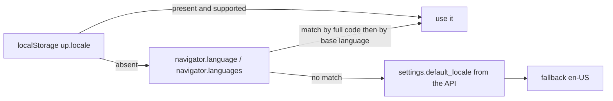

# Up - Internationalization (i18n)

> The frontend owns every translated string. The Go backend never returns a
> sentence meant for humans: it returns a **stable error code** and the UI
> translates it. That keeps a single source of truth per language.

## 1. Languages

| Code | File | Notes |
|---|---|---|
| `en-US` | `web/src/locales/en-US.json` | fallback language |
| `pt-BR` | `web/src/locales/pt-BR.json` | |
| `es-MX` | `web/src/locales/es-MX.json` | |

`DEFAULT_LOCALE` selects the language offered to **first time visitors** and must
be one of those three values (validated at boot). The administrator can change it
at runtime in Admin > Settings; the value is stored in the shared `settings`
table (`default_locale`), so all cluster nodes and all new visitors see the same
default.

## 2. Resolution order



- The choice in the header selector is persisted in `localStorage` under
  `up.locale`, so it survives reloads and wins over the administrator default.
- `document.documentElement.lang` is updated on every change (accessibility and
  correct hyphenation).
- The same pattern is used for the theme (`up.theme`, see `docs/architecture.md`).

## 3. How to use it in a component

```vue
<script setup lang="ts">
import { useI18n } from 'vue-i18n'
const { t, locale } = useI18n()
</script>

<template>
  <h1>{{ t('dashboard.title') }}</h1>
  <p>{{ t('dashboard.subtitle', { up: 4, down: 1, paused: 0 }) }}</p>
  <span>{{ t(`status.${monitor.status}`) }}</span>
</template>
```

Rules:

- **No literal UI text**: everything comes from `t('namespace.key')`. The only
  exceptions are technical identifiers (an example URL such as
  `https://example.com/health`, the content of `Code` snippets) and the language
  names themselves, which live in each locale file under `language`.
- Dates/numbers use `Intl` helpers from `web/src/lib/format.ts`, which receive
  the active `locale`.
- Pluralisation is available through vue-i18n (`t('key', { n }, n)`).

## 4. Error codes -> messages

| Layer | Responsibility |
|---|---|
| Go (`internal/i18n/errors.go`) | declares codes such as `ERR_MONITOR_NOT_FOUND` |
| Go handlers | answer `{"code":"...","message":"..."}` (message = developer detail) |
| `web/src/lib/errors.ts` | `translateError(error)` maps the code to `errors.<CODE>` |
| `web/src/locales/*.json` | holds the translated sentence under `errors` |

```ts
// web/src/lib/errors.ts (excerpt)
try { await api.createMonitor(payload) }
catch (error) { toast.error(t('common.error'), translateError(error)) }
```

If a code has no translation yet, the raw developer message is shown, which
keeps information available while a new code is being added.

## 5. Adding a language

1. Copy `web/src/locales/en-US.json` to `web/src/locales/<code>.json` and
translate the values (keep the keys identical).
2. Add the import and the entry to `web/src/i18n.ts` (`messages` map) **and** to
   `SUPPORTED_LOCALES`.
3. Add the code to `SupportedLocales` in `internal/config/config.go` so
   `DEFAULT_LOCALE` accepts it (Boot validation).
4. Document it in this file and in `docker/.env.example`.

The `language` key of the new file is the native name shown in the header
selector (e.g. `"language": "Français"`).

## 6. Key namespaces

| Namespace | Content |
|---|---|
| `app` | instance name, tagline, version labels |
| `common` | buttons and generic words (`save`, `delete`, `loading`, ...) |
| `nav` | sidebar and header navigation |
| `status` | monitor statuses (`up`, `down`, `degraded`, `pending`, `maintenance`, `unknown`) |
| `dashboard` | dashboard counters, filters and empty states |
| `monitor` | the monitor form (all fields and help texts) |
| `monitorDetail` | detail page statistics |
| `notifications` | channel management (SMTP/Webhook) |
| `statusPages` | public status page management |
| `security` | API tokens and IP rules |
| `cluster` | cluster management and strategies |
| `settings` | Admin > Settings |
| `about` | About page |
| `login` | login screen |
| `publicStatus` | public status page |
| `errors` | one entry per backend error code |

## 7. Checking parity between locales

Keys must match exactly across the three files. A quick check:

```bash
cd web/src/locales
python3 - <<'PY'
import json
base = json.load(open('en-US.json'))
for name in ('pt-BR.json', 'es-MX.json'):
    other = json.load(open(name))
    missing = [f'{ns}.{k}' for ns, keys in base.items() for k in keys if k not in other.get(ns, {})]
    extra = [f'{ns}.{k}' for ns, keys in other.items() for k in keys if k not in base.get(ns, {})]
    print(name, 'missing:', missing, 'extra:', extra)
PY
```

## 8. Defaults for new visitors (Admin > Settings)

| Control | Setting key | Effect |
|---|---|---|
| `default_locale` | `settings.default_locale` | language for visitors without a stored preference |
| `default_theme` | `settings.default_theme` | `system` / `light` / `dark` for visitors without a stored preference |

`GET /api/settings` exposes both (plus the supported lists) so the SPA can apply
them before the first render; `PUT /api/admin/settings` updates them and the
change is immediately visible in all nodes (shared table).

## 9. Theme (same design, different storage)

- Values: `system`, `light`, `dark`; persisted in `localStorage.up.theme`.
- `system` follows `prefers-color-scheme` live (a `matchMedia` listener).
- The choice is applied to `<html class="dark">`; Tailwind's `dark` variant reads
  it. A tiny inline script in `web/index.html` applies the stored value **before**
  the first paint, so there is no flash of the wrong theme.
