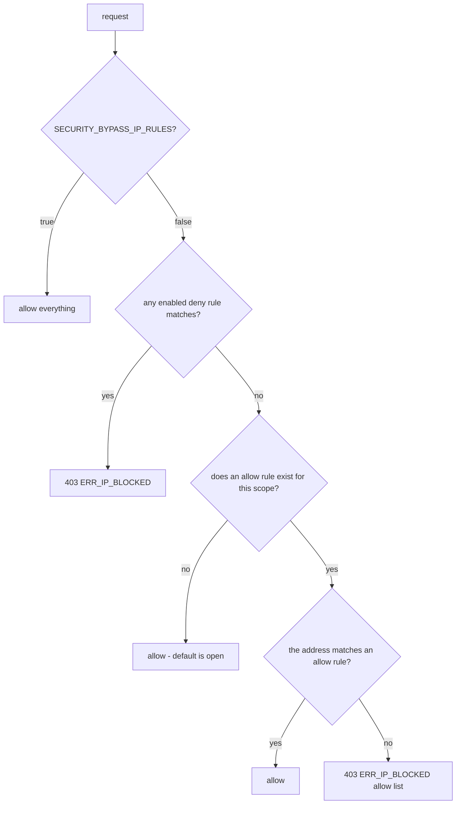

# Up - Security

> Layered defence for an instance that is often reachable from the internet: IP
> allow/deny rules, rate limiting, hashed API tokens, signed sessions, optional
> captcha and a strict e-mail allow list for OIDC.

## 1. Surfaces and default exposure

| Surface | Default | Protection |
|---|---|---|
| Dashboard (`/` and `/api/*`) | protected as soon as `AUTH_METHOD != none` | session cookie + IP rules (`dashboard`) |
| Public status pages (`/status/:slug`, `/api/public/*`) | intentionally public | IP rules (`public`) + rate limit |
| Public REST API (`/api/v1/*`) | requires a token | bearer token + scope + IP rules (`api`) |
| Cluster join (node to node) | requires the shared key | `X-Cluster-Key` / `private_key` comparison |
| Static assets | public | - |

## 2. IP rules (Admin > Security)

Model: `ip_rules(id, cidr, action, scope, note, enabled)`.

| Field | Values |
|---|---|
| `cidr` | single address (`203.0.113.7`) or network (`203.0.113.0/24`, `2001:db8::/32`) |
| `action` | `allow` / `deny` |
| `scope` | `all`, `dashboard`, `api`, `public` |
| `enabled` | rule is evaluated or not |

Evaluation order (implemented in `internal/services/iprule_decision.go`):



Key properties:

- **Open by default**: with no rule at all everything is allowed.
- A `deny` rule always wins over an `allow` rule.
- As soon as **one allow rule exists for a scope**, that scope becomes an
  **allow list**: everyone else is rejected. Use it to restrict the dashboard to
  your office/VPN while keeping status pages public.
- Rules are cached in memory for 10 s (write operations invalidate the cache).
- The address used is the one resolved by `APP_TRUST_PROXY` (see
  `docs/reverse-proxy.md`); getting that wrong is the classic source of a
  "blocked my own office" incident.

### Lockout protection

- The UI warns and shows your current `client_ip` in Admin > Security.
- Emergency switch: set `SECURITY_BYPASS_IP_RULES=true` and restart (all rules
  are ignored, an `Alert` is shown in the UI).
- Last resort: `DELETE FROM ip_rules;` in the database.

## 3. Rate limiting

| Endpoint | Limit variable | Default |
|---|---|---|
| `POST /api/auth/login` | `SECURITY_LOGIN_RATE_LIMIT` | 20 requests/minute per IP |
| `/api/public/*` and `/api/v1/*` | `SECURITY_PUBLIC_RATE_LIMIT` | 240 requests/minute per IP |

A token bucket per client address (in memory, no external dependency). Exceeding
the limit answers `429 ERR_RATE_LIMITED` with `Retry-After: 60`. Because the
buckets are per process, a multi node deployment behind a load balancer should
prefer the proxy's own rate limiting (Traefik/Nginx) for global limits.

## 4. Public API tokens

Format `up_<prefix>_<secret>`:

- `prefix` (8 hex chars) is stored in clear text and indexed for lookup;
- only the **SHA-256 hash** of the complete token is stored (`token_hash`);
- validation uses a constant time comparison and updates `last_used_at` /
  `last_used_ip`;
- scopes: `read` (status, heartbeats, statistics) and `write` (pause/resume);
- optional expiry (`expires_at`) and revocation (`revoked_at`);
- the plain value is returned **once**, in the creation response.

```bash
TOKEN=$(curl -s -b cookies.txt -X POST localhost:3000/api/tokens \
  -H 'Content-Type: application/json' \
  -d '{"name":"ci","scopes":["read"],"expires_in_days":90}' | jq -r .token)

curl -H "Authorization: Bearer $TOKEN" localhost:3000/api/v1/monitors
curl -X POST -H "Authorization: Bearer $TOKEN" localhost:3000/api/v1/monitors/6/pause
# -> 403 ERR_TOKEN_SCOPE_INSUFFICIENT for a read-only token
```

Misses/hits are logged; `ERR_TOKEN_REQUIRED`, `ERR_TOKEN_INVALID`,
`ERR_TOKEN_EXPIRED` and `ERR_TOKEN_SCOPE_INSUFFICIENT` are distinguishable on
purpose so a client can react correctly.

## 5. Sessions and cookies

| Property | Value |
|---|---|
| Name | `up_session` |
| Flags | `HttpOnly`, `SameSite=Lax`, `Path=/`, `Secure` when `APP_URL` is `https://` |
| Content | base64url JSON `{sub,email,method,iat,exp}` signed with HMAC-SHA256 |
| Secret | `settings.session_secret` (32 random bytes, generated on the first boot, shared by the cluster) |
| Lifetime | `SESSION_TTL_HOURS` (default 720) |
| Revocation | rotate `session_secret` (deletes all sessions) |

CSRF: the API is JSON-only and the cookie is `SameSite=Lax`, so a cross-site form
cannot mutate state; CORS additionally rejects an `Origin` different from
`APP_URL`.

## 6. Authentication hardening

- Constant time comparisons for the account password, the cluster key and the
  API tokens.
- OIDC with PKCE (S256), nonce and a single use signed state cookie.
- `KEYCLOAK_ACCOUNTS` allow list (exact addresses and/or domains) so a public
  identity provider cannot open the dashboard to the world.
- Optional reCAPTCHA on the login form.
- Rate limiting per IP on the login endpoint.
- Failed logins are logged with the client IP (`failed login attempt`); OIDC
  rejections are logged with the refused e-mail.

## 7. Transport and headers

Up always sends: `X-Content-Type-Options: nosniff`, `X-Frame-Options: SAMEORIGIN`,
`Referrer-Policy: strict-origin-when-cross-origin`,
`Permissions-Policy: geolocation=(), microphone=(), camera=()`.

Enable HTTPS at the proxy and consider adding `Strict-Transport-Security` there
(`docs/reverse-proxy.md`). When `APP_URL` is `https://`, the session cookie is
marked `Secure` automatically.

## 8. Secrets inventory

| Secret | Where | Rotation |
|---|---|---|
| `ACCOUNT_PASSWORD` | environment | change and restart |
| `KEYCLOAK_CLIENT_SECRET` | environment | rotate in the provider, restart |
| `RECAPTCHA_CLIENTSECRET` | environment | rotate in the console, restart |
| `CLUSTER_PRIVATE_KEY` | `settings.cluster_private_key` (or env) | Admin > Cluster > regenerate (nodes must rejoin) |
| `session_secret` | `settings.session_secret` | delete the row and restart (invalidates sessions) |
| API tokens | `api_tokens.token_hash` | revoke/delete in Admin > Security |
| SMTP/webhook credentials | `notifications.config` (JSON) | edit the channel in Admin > Notifications |

The database therefore contains credentials (SMTP passwords, cluster key):
protect the database accordingly and remember that the MySQL connection is
plaintext unless `DB_SSL=true`.

## 9. Container posture

The final image runs as the non-root user `up` (uid 1000) on Alpine, contains a
single statically linked binary and ships its own `HEALTHCHECK`. There is no
shell requirement and no package manager at runtime.
